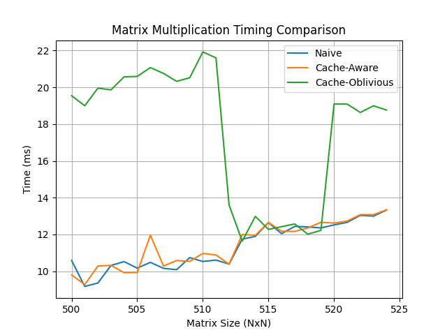

# 🔢 Cache-Aware vs Cache-Oblivious Matrix Multiplication

This project implements and benchmarks three matrix multiplication techniques:

- 🧠 **Naive Matrix Multiplication**
- 📦 **Cache-Aware Matrix Multiplication**
- 🌀 **Cache-Oblivious Matrix Multiplication**
- 🧵 **Cache-Aware-1D Matrix Multiplication** 

The goal is to understand how cache utilization and memory access patterns affect performance in large-scale matrix computations.

---

## ⚙️ Build and Run

### 1. **Compile and Run C++ Benchmark**

```bash
make
./cache_matmul --size 1024 --iterations 10       
```

This benchmarks all three implementations for matrix sizes 500 to 524 and writes the results to `results.csv`.

---

### 2. **Visualize the Results (Python)**

Make sure `matplotlib` and `pandas` are installed:

```bash
pip install matplotlib pandas
```

Then run:

```bash
python results.py
```

This script reads `results.csv` and generates a performance plot as `timing_plot.png`.

---

## 📊 Results & Analysis



### Key Observations:

- ✅ **Cache-Aware** implementation consistently performs best.
- ✅ **Naive** implementation is slightly worse but difference with Cache-aware is insignificant.
- ✅ **Cache-Oblivious** performance significantly drops when the size is 1023 and above.
- ✅ **Cache-Aware-1D** performs almost consistently, on average ~150 ns.

---

## 💡 Why These Results?

### 🧠 Naive Multiplication
- Simple triple-loop structure.
- Poor use of memory locality—especially for matrix `B` accessed by column.
- No cache consideration, but predictable access pattern.

### 📦 Cache-Aware Multiplication
- Implements **blocking** to process submatrices that fit in the L1 cache.
- Reduces cache misses and improves temporal locality.
- Optimized for the actual hardware by detecting:
  - `Cache Line Size`
  - `L1 Cache Size`

### 🌀 Cache-Oblivious Multiplication
- Uses **recursive divide-and-conquer** approach to implicitly fit data into any cache.

### 🧵 Cache-Aware-1D 
- Uses blocking to process submatrices fitting into the L1 cache
- Uses std:thread for parallel blocked matmul  
---

## 🧪 Conclusion

This experiment highlights the real-world complexity of performance optimization. 

> "Theory tells you what you *should* do. The profiler tells you what you *really* did."

---
